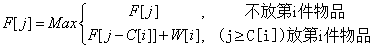

### 实验环境:

    OS:ubuntu 18.1.04 LTS
    compiler:c++11,g++
    MakeTool:CMake

### 实验原理

F[i][j]表示前i件物品中选取若干件物品放入剩余空间为j的背包中所能得到的最大价值

根据第i件物品放或不放进行决策



其中F[i-1][j]表示前i-1件物品中选取若干件物品放入剩余空间为j的背包中所能得到的最大价值.

而F[i-1][j-C[i]]+W[i]表示前i-1件物品中选取若干件物品放入剩余空间为j-C[i]的背包中所能取得的最大价值加上第i件物品的价值.

根据第i件物品放或是不放确定遍历到第i件物品时的状态F[i][j].

### 实验过程
```C++
#include <Algorythm>
#include <iostream>
#include <cstring>
#include <cstdio>
#include <cstring>
#include <algorithm>

int bag(int size, const int *weight, const int *price, int n) {
    int matrix[n][size + 1];
    memset(matrix, 0, sizeof(matrix));
    for (int i = weight[n - 1]; i <= size; ++i)
        matrix[n - 1][i] = price[n - 1];
    for (int i = n - 2; i >= 0; --i) {
        for (int j = weight[i]; j <= size; ++j) {
            matrix[i][j] = std::max(matrix[i][j], matrix[i + 1][j - weight[i]] + price[i]);
        }
    }

    for (int i = 0; i < n; ++i) {
        for (int j = 0; j <= size; ++j) {
            printf("%d ", matrix[i][j]);
        }
        puts("");
    }
    return matrix[0][size];
}

int main(int argc, char **argv) {
    int *weight, *price, N, size;
    std::cin >> N >> size;
    weight = new int[N], price = new int[N];
    for (int i = 0; i < N; ++i)
        scanf("%d%d", weight + i, price + i);
    printf("%d\n",bag(size, weight, price, N));
    return 0;
}

```
### 运行结果

#### input:

```text
3 10
3 6
6 6
5 5
```

#### output:
```text
0 0 0 6 6 6 6 6 6 12 12
0 0 0 0 0 0 6 6 6 6 6
0 0 0 0 0 5 5 5 5 5 5
12
```
