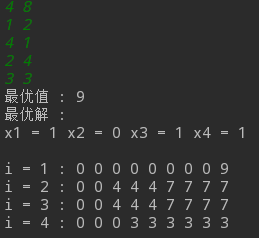

### 实验环境:

    OS:ubuntu 18.1.04 LTS
    compiler:c++11,g++
    MakeTool:CMake


### 实验过程
```C++
#include <bits/stdc++.h>
using namespace std;
void Knapsack(int *v, int *w, int n, int c, int **m)
{
    int maxx = min(c, w[n] - 1);
    for(int i = 0; i <= maxx; ++i)
    {
        m[n][i] = 0;
    }
    for(int i = maxx + 1; i <= c; ++i)
        m[n][i] = v[n];
    for(int i = n-1; i > 1; --i)
    {
        maxx = min(w[i]-1, c);
        for(int j = 0; j <= maxx; ++j)
            m[i][j] = m[i+1][j];
        for(int j = maxx + 1; j <= c; ++j)
        {
            m[i][j] = max(m[i+1][j], m[i+1][j-w[i]]+v[i]);
        }
    }
    for (int i = 0; i < c; ++i)
    {
        m[1][i] = 0;
    }
    m[1][c] = m[2][c];
    if(c >= w[1])
        m[1][c] = max(m[1][c], m[2][c-w[1]] + v[1]);
}

void Traceback(int **m, const int *w, int c, int n, int *x)
{
    int k = c;
    for (int i = 1; i < n; ++i)
    {
        if (m[i][k] == m[i+1][k])
            x[i] = 0;
        else
        {
            x[i] = 1;
            k = k - w[i];
        }
    }
    if (m[n][k] == 0)
        x[n] = 0;
    else
        x[n] = 1;
}
int main()
{
    int n, c;
    cin >> n >> c;
    int *w = new int[n+1];
    int *v = new int[n+1];
    int *x = new int[n+1];
    int **m;
    m = new int*[n+1];
    for(int i = 0; i <= n; ++i)
    {
        m[i] = new int[c + 1];
    }
    for (int i = 1; i <= n; ++i)
    {
        cin >> w[i] >> v[i];
    }
    Knapsack(v, w, n, c, m);
    Traceback(m, w, c, n, x);
    cout << "最优值 : " << m[1][c] << endl;
    cout << "最优解 : " << endl;
    for (int i = 1; i <= n; ++i)
    {
        cout << "x" << i << " = " << x[i] << " ";
    }
    cout << endl << endl;
    for (int i = 1; i <= n ; ++i)
    {
        cout << "i = " << i << " : ";
        for (int j = 0; j <= c; ++j)
        {
            cout << m[i][j] << " ";
        }
        cout << endl;
    }

    return 0;
}
/*
4 8
1 2
4 1
2 4
3 3
 */
```
### 运行结果

#### input:

```text
4 8
1 2
2 4
3 3
```

#### output:

